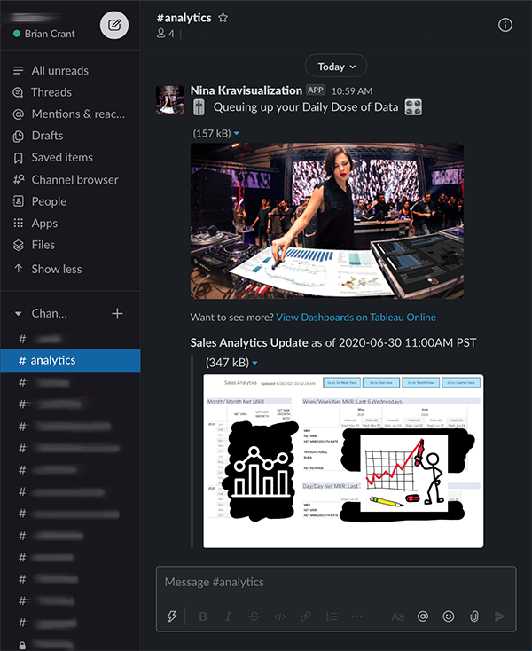

# **Sharing Data Visualizations to Slack with Python**

A step-by-step tutorial on sharing Tableau Dashboards to your Slack Workspace (featuring my favorite DJ and a little Python)

| __Overview__                         |
| -------------------------------------|
| Importance of Availability	         |
| Getting Adoption          	         |
| Tableau2Slack.py                     |
| └─ 1. Getting Started  	             |
| └─ 2. Virtual Environment Tutorial	 |
| └─ 3. Cron Tutorial  	               |

# Importance of Availability

Let's face it data analysts and business intelligence professionals: *no one is ever going to be as excited about your graphs as you are.*

People are busy, and just like you, have their own priorities to manage. Even though you  may be working towards a common goal, how your data visualizations fit into reaching that goal may not be immediately clear or seen as a priority for the end users: your colleagues.

It should come as no surprise then, why asking your colleagues to bookmark a link to your Tableau Dashboard is not inspiring the kind of company wide buy-in that results in data driven decision making.

After putting the final touches on your project, going the extra mile to facilitate the adoption of your project can be the difference between **a good presentation** and making **a tangible impact** towards a common goal. The more available your dashboards are, the easier it will be for your colleagues to prioritize them.

# Getting Adoption

> A key to success for the adoption of Business Intelligence and Data Visualization projects is ensuring that your dashboards are readily available to your end users.

For me, and I suspect many of you, the most reliable way to reach my colleagues is through our Slack workspace. Now more than ever, since working remotely for the last few months, my colleagues and I are constantly communicating and collaborating in Slack.

Unable to rely on age-old tactics like "impromptu meetings", and "sliding my chair to my colleagues desk", and "hovering over my colleagues shoulder"; recently it dawned on me that Slack presented the perfect opportunity to make my Tableau dashboards more readily available to my colleagues.

# Tableau2Slack.py

Although a native Tableau <> Slack integration does not currently exist, both companies offer robust, well documented APIs that make their super powers accessible to people like you and me. So, naturally, I enlisted the help one of my favorite DJs, [Nina Kravis](https://www.youtube.com/watch?v=oFvqo1dil7M), and started building a solution that would allow me to try a new approach:

### Instead of bringing my colleagues to the dashboards... What if I bring the dashboards to my colleagues?

In this article I will introduce **Tableau2Slack**, a Python 3.7 script that utilizes the Tableau Server Client Python library and Slack Developer Kit for Python to:  

• open a specific view on a Tableau Server (including a Tableau Online server)  
• download an image of that view to disk   
• trigger a Slack Bot to upload the image to your Slack workspace  
• share the image as a customized message to a specific channel  
• then remove the image from disk

I will then proceed to explain how you can schedule the script to run from your machine -- all without bugging your favorite engineer.

  

You can get creative and use whomever you'd like to be your deliver-er of data. Maybe it's Nina Kravis, maybe it's [Snoop Dogg](https://www.bryantgillespie.com/tagging-conversations-snoop-dogg-intercom). Take full advantage of the opportunity to bring a little joy to your data project. When the numbers aren't trending up and to the right, you can use all the help you can get. Who makes everyone smile in your office?  

As luck would have it, my colleagues have great taste in music and share in my enthusiasm for Nina Kravis. A few years ago I saw her perform in New Orleans along the Mississippi River, outside of the warehouse used to store all of the Mardi Gras floats, and it was one of only a handful of moments in life that was truly perfect.

Anyway, I'm sure you have someone in mind. Feel free to reach out if you need help customizing this for your needs. Let's begin.

## 1. Getting Started

All you will need is a connection to the internet, a Slack account, and a Tableau account. This script requires you to create and install a Slack Bot to your Slack workspace.

If you are familiar with hiding API keys and passwords by using environment variables in Python, all you need to do is gather the requirements below and plug them into the `.env` file and add that file to your `.gitignore`.

For those of you with limited to no experience with Python, APIs, or automation, the `virtualenvexample.md` and `cronexample.md` documents in this repository are geared towards you and will guide you through setting up and deploying this script using only your Mac OS or Linux machine.

### Gather Tableau Credentials
Get your Tableau Online or Server information ready. You can add this to the `.env` as you go or store elsewhere, but keep these handy.

__You will need:__  
Tableau Account Email  
Tableau Account Password  
Tableau Server Domain (list of Tableau Online [server domains here](https://help.tableau.com/current/online/en-us/to_keep_data_fresh.htm#safelist))  
Tableau Site Name (is probably `yourcompanyname`)  
Tableau View Name  
Filename for Image

### Configure Slack
You will need some admin permissions for the steps below.

1. Create a new [Slack App](https://api.slack.com/apps) for your workspace configured for `Bots` and `Permissions`.

2. Create a Slack Bot and give it `chat:write`, `chat:write.customize`, and `files:write` Bot Token Scopes.

3. Install your Slack Bot to your workspace.

4. Add the Slack Bot User OAuth Access Token to `.env`

5. Add the channel you want to post to in `.env` (You can use a test one for now and change this later)

6. Create a #tableau-test channel in your Slack account to store the image.

Now that you have defined all of your variables in your `.env` file, head to `virtualenvexample.md` to learn how to create an isolated environment for the script to run.

## 2. Virtual Environment Example

This is tutorial is geared towards beginners that would like to learn how they can deploy this script to run on a schedule. If you are familiar with virtual environments and cron jobs, this won't be anything new for you.  

We are going to use a Python package called `virtualenv` to create an isolated Python environment on our Mac OS. This means we will be able to run the script away from our global Python install and configurations, and therefore will not have to worry about dependencies or upgrades breaking our script in the future. If you have never heard of a virtual environment, I would recommend you begin by watching this video on [why you should use virtual environments](https://www.youtube.com/watch?v=N5vscPTWKOk_).

After we create the virtualenv, we will use a built-in Mac OS utility called `cron` to schedule the script to run in the virtual environment we have built at a frequency of our choosing. Cron is a powerful tool with minimal overhead and it will take you two minutes to learn -- more on that later.

### `virtualenv` Installation
Start by installing `virtualenv` to your global Python install. I will be demonstrating using Python3.7, if you use a different version some things may not hold true so be sure to adjust accordingly.

Install command: `pip install virtualenv`

Check the installation: `virtualenv --version`

Create a project folder for this virtual environment. Let's put it on your desktop and name it `tab2slack` (adjust your filepath).

`cd /Users/brian/Desktop && mkdir tab2slack`

Make sure you are in the directory we just created and double check where your Python3.7 installation is so that we can clone it in the virtual environment:
```
$ cd /Users/brian/Desktop/tab2slack

$ which python3.7
/usr/local/bin/python3.7
```

### `virtualenv` Set Up
Time to create the environment. You can reference the [virtualenv documentation](https://virtualenv.pypa.io/en/stable/user_guide.html) for greater detail but here's the quick start. Be sure to change out the filepath for your python3.7 installation that we just grabbed above:

`virtualenv -p /usr/local/bin/python3.7 venv`

Take a peek inside the folder so you can see the results, then go back to terminal and activate the environment:

`source venv/bin/activate`

The name of the virtual environment should now appear to the left in your terminal. We'll go ahead and upgrade `pip` in the virtual environment:

`pip install --upgrade pip`


Next we need to install the packages required for this project. Download the `requirements.txt` from the Tableau2Slack repository on Github and put it in your local `tab2slack` project folder. While you're there download `Tableau2Slack.py` and do the same.

### Environment Variables
I use the package `dotenv` to manage environment variables. This is where you hide your API keys ect by creating a `.env` file in the project folder to store the key pairs. They remain private by adding that file to your `.gitignore`.  

All of the Tableau Server Client samples use `argparse`, which I'm sure is similar, but I am just a little data boi and that was slowing me down so I stuck with what I am familiar with, and replaced the variables to be called from `dotenv`.  

There are explanations and examples of these key pair values inline in the `Tableau2Slack.py` script and I have included a sample `.env` for you in repository with the variable names. You just need to add your own keys. If the file is not visible when you make or download it, on a Mac hit Command + Shift + . to show hidden files in your directories. /sidenote  

In your terminal, with the virtual environment activated and `requirements.txt` in your project folder, we will hop into the `site-packages` directory and install all of the package dependencies there:

`cd /{project_path}/tab2slack/venv/lib/python3.7/site-packages && pip install -r /{project_path}/tab2slack/requirements.txt -t .`

You can run `pip list` to double check that all the requirements are installed. Almost there! Head over to `cronexample.md` to schedule this script to run on your machine.

## 3. Cron Example

This is tutorial is geared towards beginners that would like to learn how they can deploy this script to run on a schedule. If you are familiar with virtual environments and cron jobs, this won't be anything new for you.  

After you have built the virtual environment on your machine using `virtualenv` and successfully ran the script from the terminal in that directory using something like...

`cd ~/tab2slack && python3.7 Tableau2Slack.py`

...the following code will execute Tableau2Slack.py at 9am on weekdays only, and print the output log to the virtual environment directory. (*Be sure to replace `/{project_path}/` with your own filepath to the project*)

```
0 9 * * 1-5 /{project_path}/tab2slack/venv/bin/python3.7 /{project_path}/tab2slack/Tableau2Slack.py >> /{project_path}/tab2slack/Tableau2Slack-cronlog.txt 2>&1
```
Now let's take a closer look at what is going on in that command...

### Under the Hood

`0 9 * * 1-5` declares the schedule the command will run on. Following the documentation from `crontab`...
```
* * * * *  command to execute
│ │ │ │ │
│ │ │ │ └─── day of week (0 - 6) (0 to 6 are Sunday to Saturday, or use names; 7 is Sunday, the same as 0)
│ │ │ └──────── month (1 - 12)
│ │ └───────────── day of month (1 - 31)
│ └────────────────── hour (0 - 23)
└─────────────────────── min (0 - 59)
```
...we can see we that the script will run at 0 minutes of the 9th hour on all days of the month for all months on the 1st through 5th day of the week (Mon-Fri).

During testing, I recommend you change the schedule to `* * * * *` to run the job every minute, but hey, it's your life. Go crazy. Take all the time you damn well please.

`/{project_path}/tab2slack/venv/bin/python3.7` specifies the `whereis` Python3.7 install that will run the script.

`/{project_path}/tab2slack/Tableau2Slack.py` is the complete filepath to the script, which we need to specify because by default `crontab` will use the home directory, which varies by machine and operating system. On MacOS this is `/Users`, but on Linux for instance the default home directory would be `/home`, but could also be somewhere under `/var` or `/usr`.

`>> /{project_path}/tab2slack/Tableau2Slack-cronlog.txt` tells the machine that when it executes Tableau2Slack.py, to redirect the output `>>` to a text file in the same directory as the script called `Tableu2Slack-cronlog.txt`.

`2>&1` says that since we redirected the standard output to that text file, we also want to print the standard error there as well. This is out of the scope of this project, but [here is a real page turner](https://www.brianstorti.com/understanding-shell-script-idiom-redirect/) explaining why 1 is `stdout` and 2 is `stderr` in this command.


### Installation

From your Mac OS terminal enter `$ crontab -e`

This will open `crontab` in edit mode.

Hit `i` on your keyboard to enter INSERT mode. If you already have cron jobs installed you can hit `a` to enter APPEND mode and skip to the end of the line.

Edit the filepaths in the command at the top of this document and paste them in. Each new line, represented by \* is a separate `crontab` job.

To save, hit `esc` on your keyboard to exit INSERT mode, then type `:wq` and press ENTER on your keyboard to close the vim terminal.

If the command is accepted, you will receive the output: "crontab: installing new crontab".

To check what `crontab` jobs you have installed on your machine, you can run `$ crontab -l`.

That's it! Feel free to reach out if you have any questions.

Thanks to Keshia Rose, Clay Wilkerson, and Mike Potts for reviewing drafts of this article, and thanks especially to John McDonald for help with the documentation.

---
Tags:

`Data Visualization` `Business Intelligence` `Tableau` `Python` `Slack`
